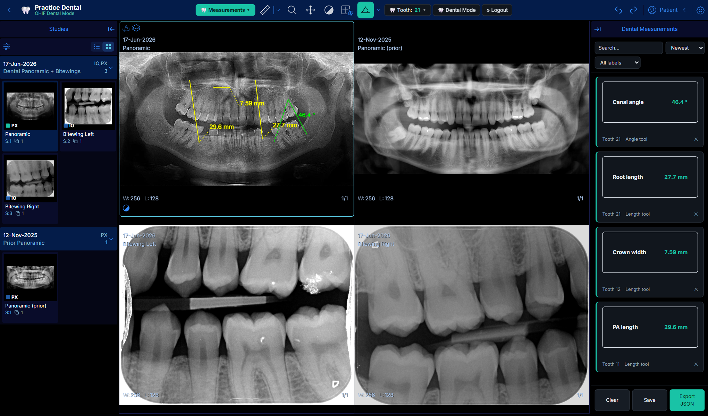

# Dental SaaS Platform — OHIF Dental Mode

A customization of the [OHIF Viewer](https://github.com/OHIF/Viewers) into a **Dental Mode**: a dental Practice Header, a 2×2 hanging protocol, and a **Dental Measurements** feature, backed by a **Node.js API** for authentication and viewer-state persistence.

The customization lives in two OHIF packages — `@ohif/extension-dental` and `@ohif/mode-dental` — under `Viewers/`. OHIF core is untouched apart from two registration points.



*Bundled sample study in the 2×2 layout: current panoramic (top-left), prior panoramic (top-right), and left/right bitewings, with measurements in the right panel.*

---

## What's implemented

### A) Dental Mode UI

| Requirement | Where |
| --- | --- |
| Dental theme toggle (colors / typography) | `extensions/dental/src/components/ThemeToggle.tsx` + `dental.css` — flips `<html data-dental-theme>` |
| Practice Header — practice name | `whiteLabeling` in `platform/app/public/config/default.js`, from the signed-in user |
| Practice Header — patient info | OHIF's `HeaderPatientInfo`, from the loaded study |
| Tooth Selector (FDI / Universal) | `extensions/dental/src/components/ToothSelector.tsx` + `teeth.ts` |
| 2×2 hanging protocol (current / prior / bitewings) | `extensions/dental/src/getHangingProtocolModule.js` |

The Tooth Selector and Measurements button appear only while Dental Mode is on; toggling it off returns the standard OHIF toolbar.

### B) Dental Measurements

| Requirement | Where |
| --- | --- |
| One-click measurement presets | `extensions/dental/src/components/MeasurementsButton.tsx` + `presets.ts` |
| Periapical length (mm) → distance tool, labeled "PA length" | preset `pa-length` → cornerstone `Length` |
| Canal angle (°) → angle tool, labeled "Canal angle" | preset `canal-angle` → cornerstone `Angle` |
| Crown width / Root length (mm) | presets `crown-width`, `root-length` |
| Right panel with sort + filter | `extensions/dental/src/components/DentalMeasurementsPanel.tsx` |
| Export measurements to JSON | `DentalService.exportJSON` (`dental-measurements/v1` schema) |

Presets build on OHIF's `measurementService`: arming a preset activates the cornerstone tool and a pending label; on the next draw, `DentalService` tags the measurement with the dental label and selected tooth. Values (mm / °) come from the DICOM pixel spacing.

### Backend (authentication + persistence)

- A login/registration gate (`extensions/dental/src/auth/`) obtains a JWT; the backend enforces it on every viewer-state and measurement route (`backend/src/middleware/auth.js`).
- Viewer state (theme, numbering system, selected tooth) is saved per user and restored on next login.
- Measurements are saved per study and can be exported.

---

## Repository layout

```
dental-saas/
├─ Viewers/                                       OHIF Viewer v3.12.4 + the dental customization
│  ├─ extensions/dental/                          the Dental extension
│  ├─ modes/dental/                               the Dental mode
│  ├─ platform/app/pluginConfig.json              registers the extension + mode
│  ├─ platform/app/public/config/default.js       whiteLabeling (practice name)
│  └─ platform/app/public/dental-samples/         bundled sample study (DICOM + manifest)
├─ backend/                                        Express API: JWT auth, viewer-state, measurements
├─ tools/source-images/                           source dental radiographs
├─ tools/make_dental_sample.py                    wraps them into the sample DICOMs + manifest
├─ docker-compose.yml + deploy/                   containerized stack (OHIF + backend + proxy)
└─ docs/                                           screenshots
```

---

## Quick start

Prerequisites: Node 18+, yarn 1.x (`npm i -g yarn`).

**Backend**

```bash
cd backend
npm install
npm start            # http://localhost:4000
```

**OHIF frontend**

```bash
cd Viewers
yarn install         # first run pulls the OHIF dependency tree
yarn workspace @ohif/app dev
```

Open **http://localhost:3000** and sign in with the demo account `dentist@demo.com` / `demo1234`.

Open the bundled sample dental study (current + prior panoramic, left/right bitewings):

```
http://localhost:3000/dental/dicomjson?url=/dental-samples/dental-study.json
```

The study is served from the app via OHIF's `dicomjson` data source — no external PACS needed. To regenerate it from the source images, run `python tools/make_dental_sample.py` (requires `pydicom`, `numpy`, `pillow`). Any other study can be opened against the default DICOMweb source, e.g. `http://localhost:3000/dental?StudyInstanceUIDs=<uid>`.

The frontend talks to the backend at `http://localhost:4000/api` in development. Use `yarn workspace @ohif/app dev` rather than the root `yarn dev`.

---

## Backend API

All routes under `/api`; protected routes require `Authorization: Bearer <token>`.

| Method | Path | Auth | Description |
| --- | --- | --- | --- |
| `GET` | `/api/health` | – | Health check |
| `POST` | `/api/auth/register` | – | `{ email, password, name, practiceName }` → `{ token, user }` |
| `POST` | `/api/auth/login` | – | `{ email, password }` → `{ token, user }` |
| `GET` | `/api/auth/me` | ✓ | Current user |
| `GET` / `PUT` | `/api/viewer-state` | ✓ | Get / merge-and-persist viewer state |
| `GET` / `POST` / `PUT` / `DELETE` | `/api/measurements` | ✓ | List / create / bulk-replace / delete |

Config via `backend/.env` (see `backend/.env.example`): `PORT`, `JWT_SECRET`, `CORS_ORIGIN`, `DB_FILE`, demo-seed settings. Tests: `cd backend && npm test`.

---

## Deployment

`docker compose up --build` brings up three services behind a single origin on port 8080: an nginx proxy, the OHIF frontend (`Viewers/Dockerfile`), and the backend (`backend/Dockerfile`). Because everything shares an origin, the API client resolves to a same-origin `/api` with no extra configuration.

```bash
JWT_SECRET=$(openssl rand -hex 32) docker compose up --build
```

For a split-origin deployment, build the two images separately and point the frontend at the backend by setting `window.__DENTAL_API__ = 'https://<backend-domain>/api'`. Set `JWT_SECRET` and a restricted `CORS_ORIGIN` in any real deployment.

---

## Demo

Demo video: _link to be added._
